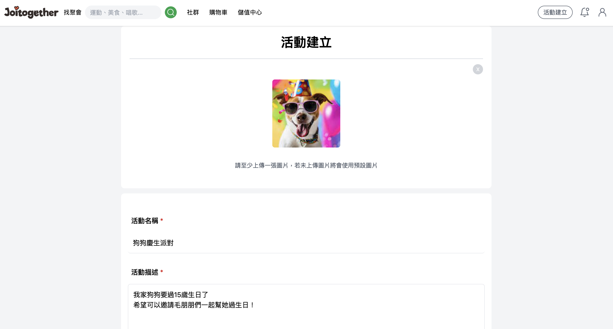
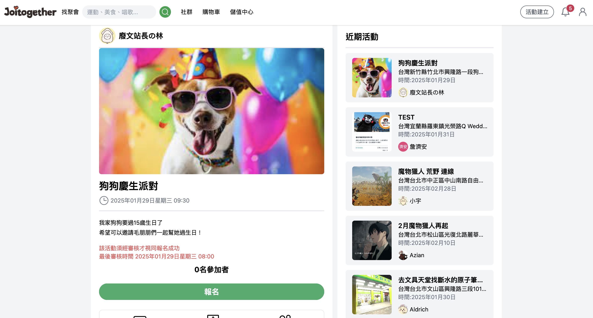
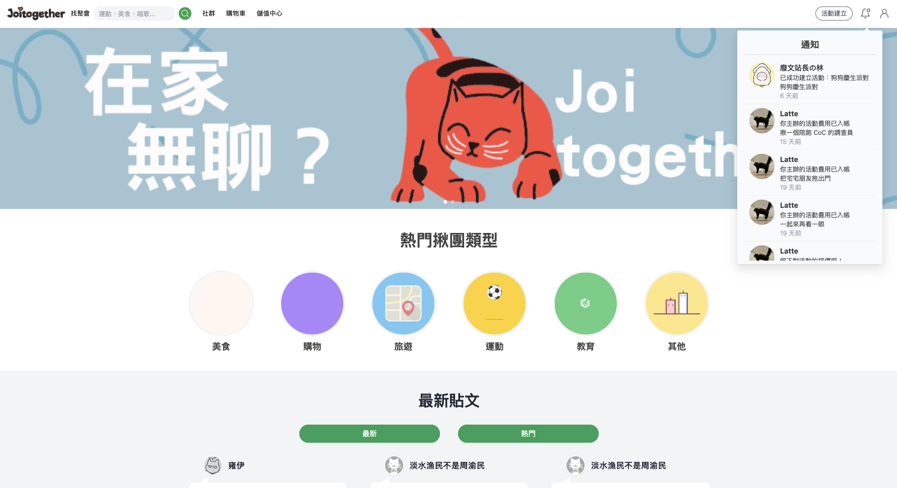
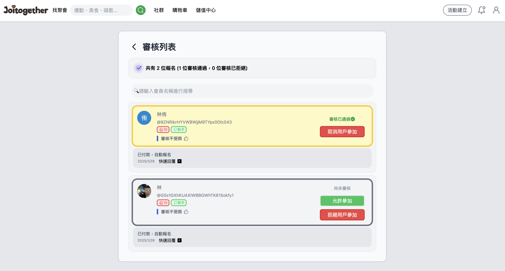
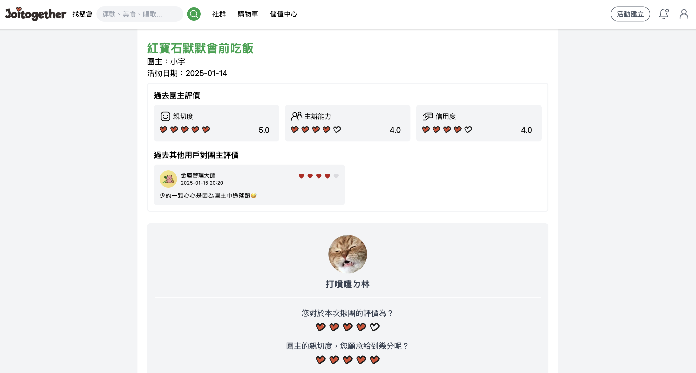
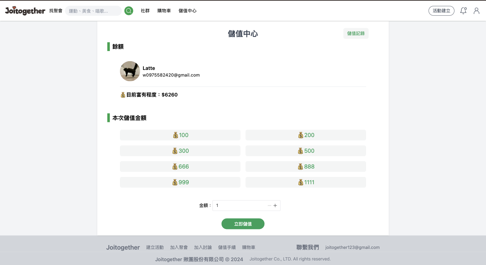
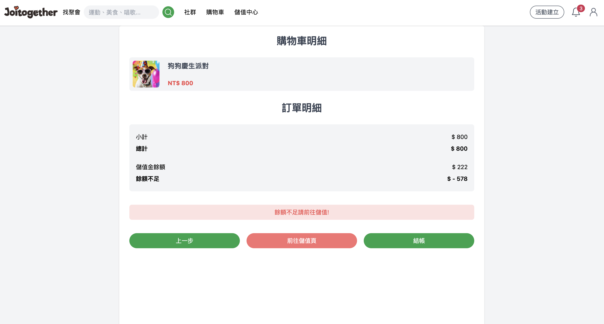
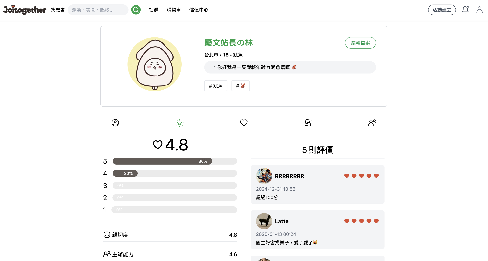

> 一個專為社交聚會與團隊協作打造的群組邀請與管理平台。

📌 **專案連結**：[🔗 Joitogther 🤝🌟](https://joitogether.com/home)
 

📌 **GitHub Repo**：[🔗 Joitogether GitHub](https://github.com/Joitogether/Joitogether)

## 🌟 介紹  
**Joitogether** 是一款專門為活動愛好者設計的平台，讓用戶能夠輕鬆建立聚會、管理邀請與參加聚會。  
這個專案採用 **Vue 3 + Naive UI** 打造直覺化的使用介面，並搭配 **Express.js + Prisma** 進行後端數據管理，確保流暢的體驗與穩定的資料存儲。  

**無論是私人聚餐、讀書會，還是線上協作，Joitogether 幫助你簡化繁瑣的邀請流程，確保活動順利進行！** 🚀  

---

## 🪄 關於 Joitogether  
創作者是一群喜歡大家一起出去玩的人。  
因為現代人出社會久了，學生時代的朋友也都有各自的事業，  
因而無法隨時揪團就出發，所以開發者們寫出了可以 **隨揪隨行** 的網站，  
讓每一位喜歡 **一群人一起做一件事情** 的朋友們，可以建立自己的小天地。  

**揪愛 Together！❤️**  

---

## 📌 功能特色  

### 🏠 活動首頁  
  

✅ **最新文章與熱門文章**：首頁顯示最新發表的活動資訊，並可瀏覽近期最受歡迎的活動。  
🔎 **活動瀏覽與搜尋**：用戶可透過關鍵字搜尋、分類篩選，快速找到符合需求的活動。  
📅 **快速活動總覽**：清楚列出即將舉辦的活動，包括時間、地點與參與狀況，方便用戶快速決策。  

---

### 🪧 登入/註冊  
  

✅ **多元登入方式**：支援 **一般信箱註冊** 與 **Google 第三方登入**，提供便利的登入體驗。  
🔒 **安全驗證機制**：透過 **Firebase Auth** 驗證用戶身份，確保帳號安全。  
📂 **個人化資料管理**：用戶可上傳大頭貼，個人資訊同步儲存至 **MySQL 資料庫**，確保資料完整性。  

---

### 📅 建立活動  
  

✅ **活動資訊輸入**：用戶可建立活動，填寫詳細資訊，並將數據存入 **後端資料庫**。  
📍 **Google Map 整合**：直接串接 **Google Maps API**，讓活動地點輸入更直覺、精確。  
⚙️ **活動條件設定**：團主可自訂 **審核條件**，並決定活動是否需 **先付款** 才能參加。  

---

### 📜 活動報名與留言互動  
  

✅ **活動詳細資訊**：提供 **地點、時間、參加條件** 等重要資訊，讓用戶一目了然。  
📝 **報名機制**：用戶可直接報名活動，系統將自動判斷是否符合條件。  
💬 **留言與評價**：用戶可在活動頁面留言互動，查看團主的 **過往評價**，決定是否參加。  
🔄 **即時渲染**：動態顯示後端活動數據，根據不同的報名條件提供相應的 **彈窗提示**。  

---

### 🔔 即時通知與提醒  
  

✅ **活動與文章通知**：當用戶關注的 **團主建立活動或發布文章**，將即時收到通知。  
📩 **更新即時推播**：文章被留言或有人報名活動時，用戶將收到即時推播。  

---

### 📝 活動審核系統  
  

✅ **報名者篩選**：團主可瀏覽報名者的資料，並決定是否批准其加入活動。  
💰 **付款審核機制**：在需要 **先付款** 的活動中，報名者須完成付款才能進入審核階段。若團主拒絕報名，系統將 **自動退費**。  

---

### ⭐ 活動評價系統  
  

✅ **活動結束後評價**：參與者可對團主與活動進行評價，留下評論，幫助其他用戶參考。  
🔎 **評價顯示**：用戶可查看過去其他人對團主的評價，並顯示最多四則評論。  
📡 **RESTful API 數據管理**：透過 API 進行評價的發送、儲存與更新，確保評價數據的完整性。  

---

### 💰 儲值系統  
  

✅ **一鍵儲值**：用戶可透過儲值金支付活動費用，確保交易便捷。  
💳 **藍新金流整合**：提供 **安全、快速** 的金流交易，確保支付安全性。  

---

### 🛒 購物車金流  
  

✅ **活動付款與退款**：所有交易均透過 **儲值金** 處理，確保交易透明且流暢。  
⚡ **快速儲值**：當儲值金不足時，可直接跳轉儲值頁面，並透過 **藍新金流** 完成支付。  

---

### 👤 個人頁面  
  

✅ **個人資料總覽**：用戶可查看 **個人專長、興趣、過去活動評價、發起的活動與文章、追蹤的用戶**。  
🔄 **數據即時渲染**：透過 API 撈取資料，確保頁面顯示最新資訊。  

---

## 🚀 Tech Stack  
- **前端**：Vue 3 + Naive UI  
- **後端**：Express.js + Prisma + MySQL  
- **身份驗證**：Firebase Auth  
- **部署**：Railway   

---

## 📬 聯絡方式  
如果你對 **Joitogether** 有興趣，或者有任何建議，歡迎聯絡我！   
📩 <strong>Email</strong>：<a href="mailto:latte.0975582420@gmail.com" >latte.0975582420@gmail.com</a>

---