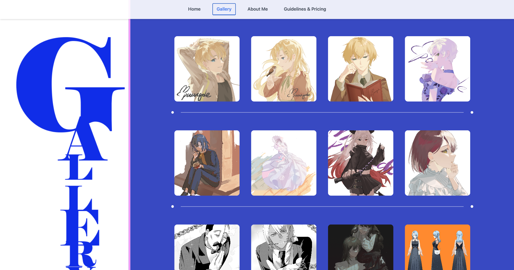
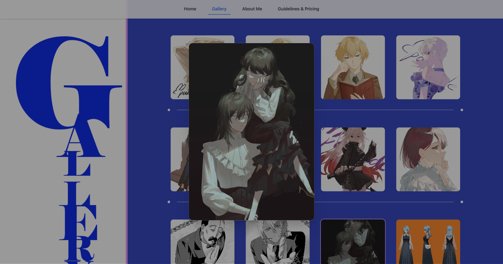
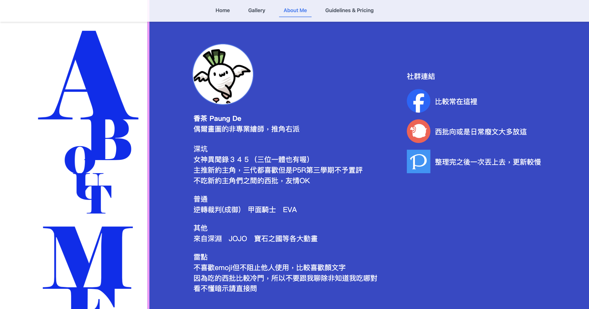
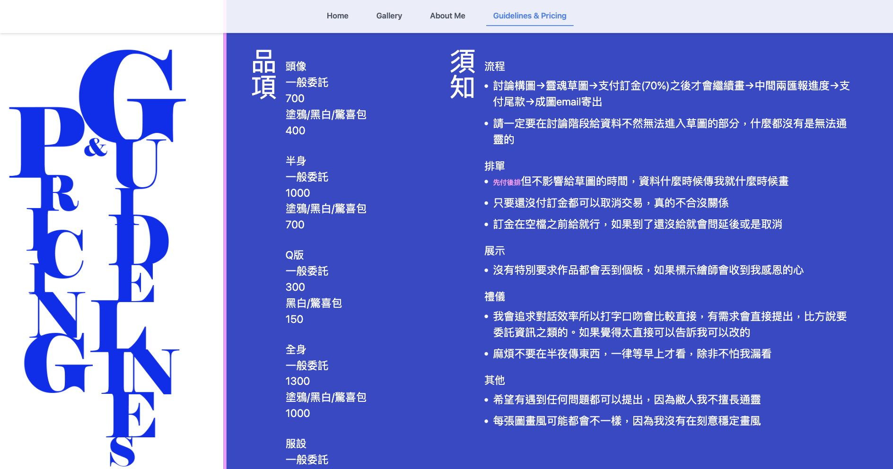

> 一個專為藝術創作者打造的個人畫廊與委託平台。

📌 **專案連結**：[🔗 Pyramid of DeadLines 🎨🖌️](https://piramid-latte-studio.vercel.app/)
 

📌 **GitHub Repo**：[🔗 Piramid GitHub](https://github.com/Warmlatte/Piramid)

---

## **🌟 介紹**
Piramid 是一個專為繪師打造的個人接案與作品展示網站，採用 Vue 3 + Tailwind CSS 打造簡潔美觀的介面，提供直觀的作品呈現與委託須知，方便潛在客戶快速了解接案流程。

---
## **🪄 命名的小故事**
為什麼叫 Piramid 呢？🤔 這其實是繪師對自己創作生活的一種幽默調侃。繪師每天都像被靈感與死線活埋在「創作的金字塔」裡，左手靈感、右手壓力，但最後還是能創造出讓人驚嘆的作品。✨

所以我們戲稱這座網站為 Piramid of DeadLines，象徵繪師在無數次趕稿與創意爆發中堆砌的藝術殿堂！一句話總結： “Buried under deadlines and ideas, but still making art happen.” 🎨🖌️

---

## **📌 功能特色**
✅ **智能導航設計**：首頁隱藏 Navbar，離開首頁後自動顯示固定導航，提升瀏覽體驗。  
🖼 **作品展示與彈窗預覽**：根據資料動態渲染畫作，點擊作品開啟彈窗檢視細節。  
📜 **委託須知與價格展示**：清晰標示可接案類型、價格範圍與規則，簡化溝通流程。  
🔗 **社群與聯絡整合**：內建社群連結與快速聯絡按鈕，提高客戶互動便利性。  
⚡ **效能優化與 SEO**：使用 Vite 打包，提升載入速度並優化搜尋引擎曝光度。  

---

## **🚀 Tech Stack**
🔹 **前端**：Vue3 + Vite  
🔹 **樣式**：Tailwind CSS + DaisyUI  
🔹 **部署**：Vercel  
🔹 **圖片管理**：本地存儲 

---

## **📷 頁面展示**
> 以下是 Piramid of DeadLines 的頁面截圖：

### **🏠 首頁**

### **🖼️ 圖庫**

### **🔍 圖庫彈窗**

### **📖 關於我**

### **💰 委託須知**

---

## **📬 聯絡方式**
如果你對 Piramid 有興趣，或者有任何建議，歡迎聯絡我！  
📩 <strong>Email</strong>：<a href="mailto:latte.0975582420@gmail.com" >latte.0975582420@gmail.com</a>
